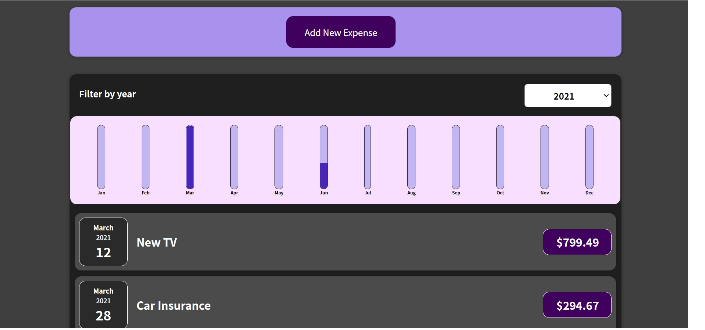
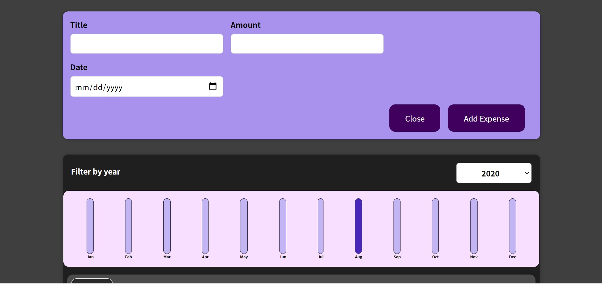

# Expense App

view your expenses or add new expenses.

sort your expenses by year and compare between the months with this simple reactive ui

## Installation

Install my-project with npm

```bash
  cd ExpenseApp
  npm install package.json
```
    
## Screenshots





